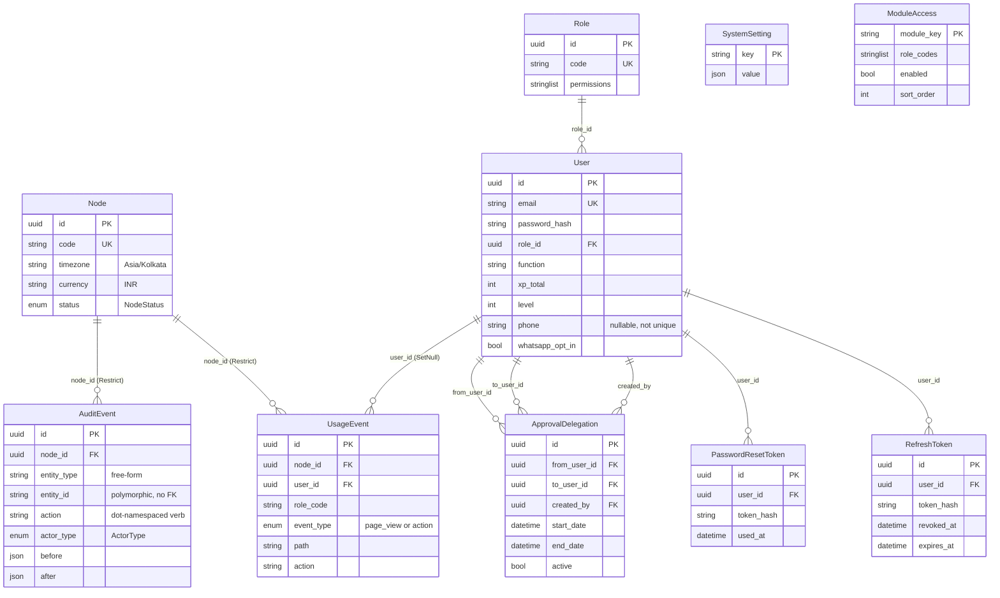
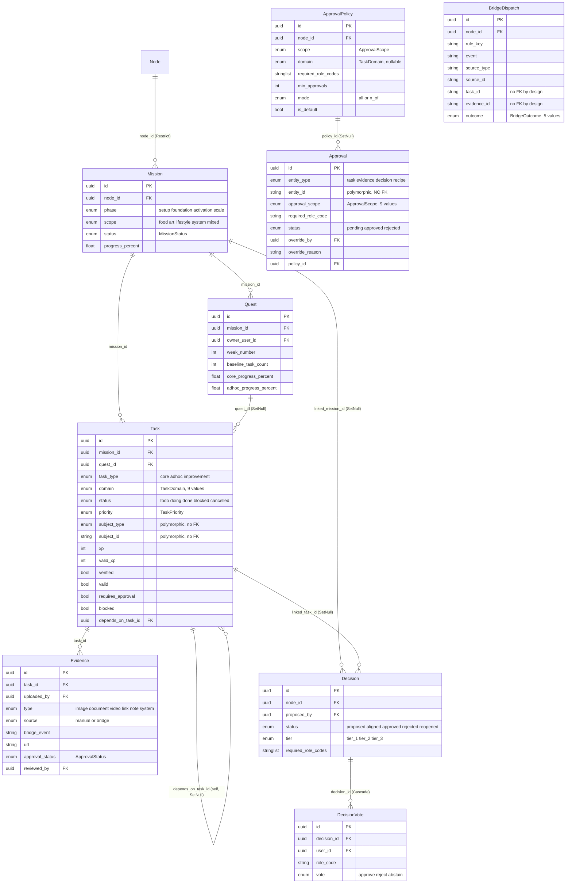
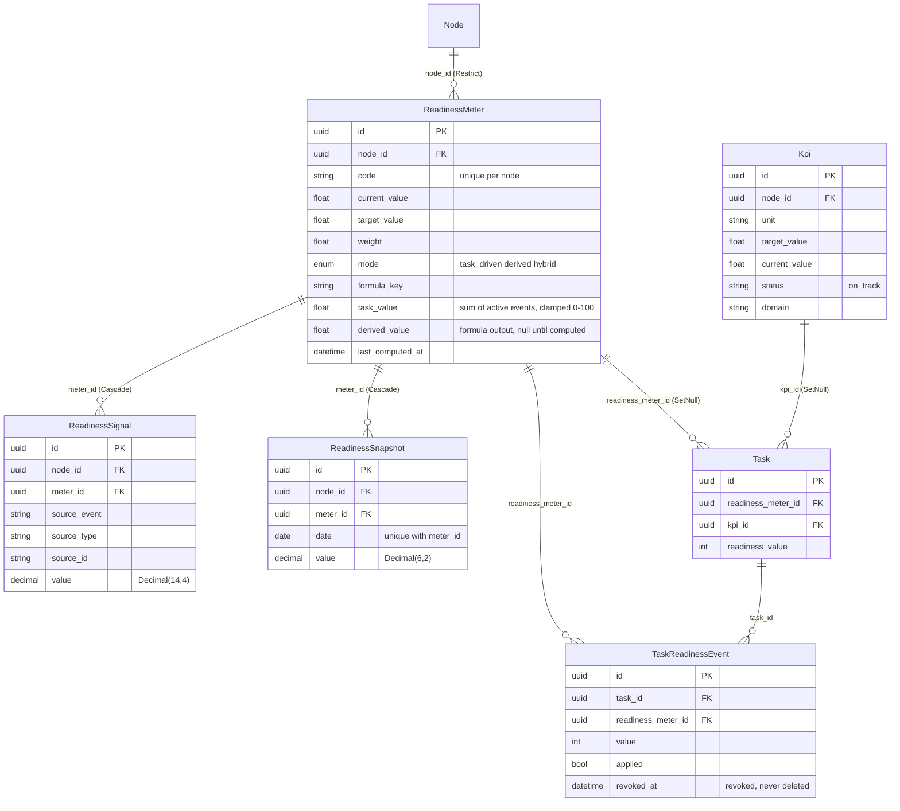
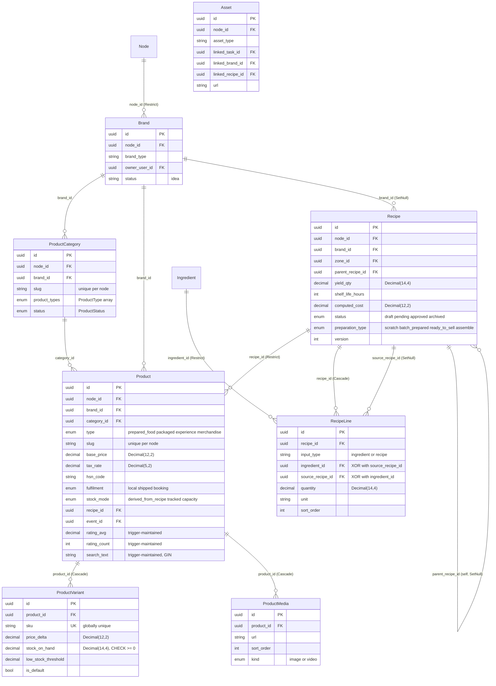
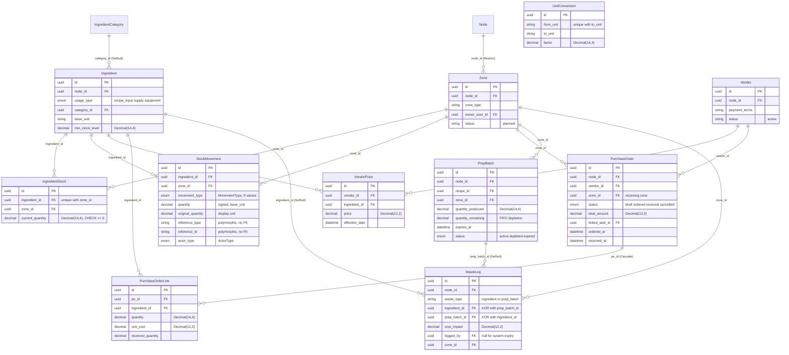
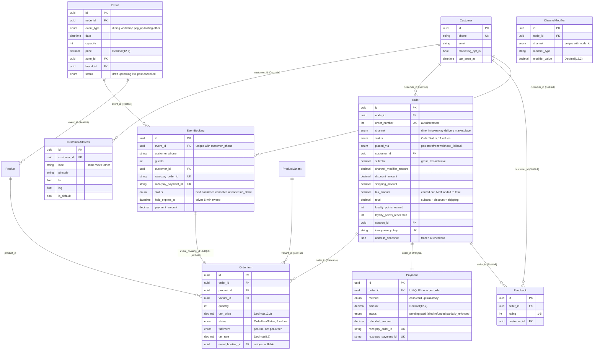
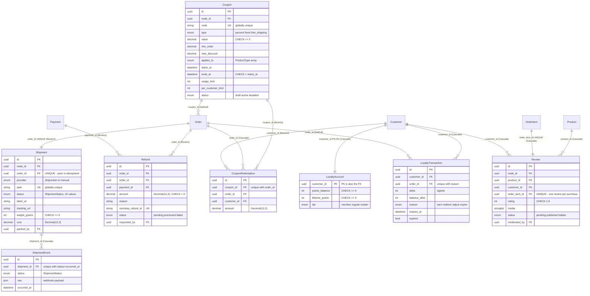

> 🗄️ **Database as-built.** Snapshot `2cab09e`, tag `as-built-2026-09-03`.
> PostgreSQL 16.15, accessed through Prisma 6. Source of truth for this document is
> `backend/prisma/schema.prisma` (1,962 lines) and the five directories under
> `backend/prisma/migrations/`. Every constraint claim below was cross-checked
> against a live `pg_constraint` / `pg_indexes` query on the local demo database,
> so the numbers are what Postgres actually holds, not what the schema file implies.

## Shape

| Measure | Count | Where |
| --- | --- | --- |
| Models (tables) | **71** | `schema.prisma` |
| Enums | **55** | `schema.prisma:12-427` |
| Migrations | **5** | `backend/prisma/migrations/` |
| Foreign keys | **146** | `pg_constraint` where `contype='f'` |
| CHECK constraints | **12** | all hand-written; see [Constraint inventory](#constraint-inventory) |
| Indexes | **212** total, **109** unique (71 of those are primary keys) | `pg_indexes` |
| Triggers | **5** (3 functions) | `Product`, `GuidePage`, `Review`, `ProductCategory`, `Brand` |
| Advisory locks | **8** | `backend/src/common/utils/advisory-lock.ts:25-34` |

Two structural conventions run through the whole schema:

- **Single-node tenancy.** 32 aggregate models carry `node_id` with a Prisma-level
  `@default("11111111-1111-4111-8111-111111111111")` pointing at the seeded row, and
  every one of those FKs is `onDelete: Restrict`. The comment at `schema.prisma:429-432`
  is explicit that the `@default` is scaffolding to be dropped when a second node
  is introduced — the column is real, the default is a convenience.
- **Money is `Decimal`, never float.** Rupee amounts are `@db.Decimal(12,2)`,
  quantities `@db.Decimal(14,4)`, tax rates `@db.Decimal(5,2)`. Arithmetic never
  happens on these types — see [Money handling](#money-decimal-at-the-boundary-integer-paise-in-the-middle).

---

## Model inventory

### Platform & tenancy (6)

| Model | Purpose | Key relations |
| --- | --- | --- |
| `Node` | The deployment's operating node; v2.0 runs exactly one (`schema.prisma:433`). Holds timezone + currency. | Parent (`Restrict`) of 25 aggregates |
| `SystemSetting` | Global key/value config, `value` is `Json` so a key can hold a scalar, object or array. Deliberately **not** node-scoped. | none (`key` is the PK) |
| `ModuleAccess` | Data-driven module visibility per role code — separate from the permission set, so a role can hold `MANAGE_KITCHEN` without seeing every kitchen page (`schema.prisma:953-963`). | none (`module_key` is the PK) |
| `AuditEvent` | Every mutating write records one, inside the same transaction. `entity_type`/`action` are free-form dot-namespaced strings so new domains need no migration. | → `Node` |
| `UsageEvent` | Page views and dotted action keys per role (SPEC §8 / IA-07). Fire-and-forget writes, never inside a business transaction. | → `Node`, → `User` (`SetNull`) |
| `Channel` | Sales-channel reference rows (name, type, status). No FK edges — a lookup list. | none |

### Identity & RBAC (5)

| Model | Purpose | Key relations |
| --- | --- | --- |
| `Role` | Code + `permissions String[]`. Permission strings are the authorisation primitive. | ← `User` |
| `User` | Staff account. Carries gamification state (`xp_total`, `level`, `streak_days`) and the WhatsApp nudge gate (`phone`, `whatsapp_opt_in`). | → `Role`; owner/creator/updater on ~30 relations |
| `RefreshToken` | Hashed refresh tokens with `revoked_at` / `expires_at`. | → `User` |
| `PasswordResetToken` | Hashed single-use reset tokens with `used_at`. | → `User` |
| `ApprovalDelegation` | Time-boxed "approve on my behalf" grant. Three separate `User` edges: from, to, creator. | → `User` ×3 |

### Mission loop & governance (9)

| Model | Purpose | Key relations |
| --- | --- | --- |
| `Mission` | Top of the work hierarchy — phase, scope, status, rolled-up `progress_percent`. | → `Node`; ← `Quest`, `Task` |
| `Quest` | A week of work inside a mission, with an owner and separate core/adhoc progress percentages. | → `Mission`, → `User` |
| `Task` | The unit of work and the hub of the schema. Polymorphic `subject_type`/`subject_id` points at a domain record; carries XP, verification, blocking and a self-referencing dependency. | → `Mission`, `Quest?`, `User` ×3, `Task?` (self), `ReadinessMeter?`, `Kpi?` |
| `Evidence` | Proof attached to a task — image, document, video, link, note or system. `source` distinguishes human uploads from bridge-generated ones. | → `Task`, → `User` (uploader, reviewer) |
| `Approval` | A pending or settled approval. `entity_id` is **polymorphic with no FK** (task / evidence / decision / recipe) so approvals never block a delete (`schema.prisma:728-731`). | → `User` ×3, → `ApprovalPolicy?` (`SetNull`) |
| `ApprovalPolicy` | Which role codes must approve a given scope+domain, how many, and in what mode (`all` / `n_of`). | → `Node`; ← `Approval` |
| `Decision` | A governance decision with a tier, required role codes, and optional links back to a task or mission. | → `Node`, `User`, `Task?`, `Mission?` |
| `DecisionVote` | One vote per user per decision, enforced by a unique index. | → `Decision` (`Cascade`), → `User` |
| `BridgeDispatch` | The MissionBridge exactly-once ledger — one row per (rule, source entity). A replayed domain event hits the unique constraint and becomes a no-op. `task_id`/`evidence_id` recorded **without** FKs, same reasoning as `Approval`. | → `Node` |

### Readiness & KPIs (5)

| Model | Purpose | Key relations |
| --- | --- | --- |
| `ReadinessMeter` | A named readiness dimension. `mode` selects `task_driven`, `derived` (formula) or `hybrid`; keeps `task_value` and `derived_value` separately so the two contributions never overwrite each other. | → `Node`; ← `Task`, signals, snapshots, events |
| `TaskReadinessEvent` | One task's contribution to a meter, revocable (`applied`, `revoked_at`) rather than deleted. | → `Task`, → `ReadinessMeter` |
| `ReadinessSignal` | Raw derived-mode input: a source event with a `Decimal(14,4)` value. | → `Node`, → `ReadinessMeter` (`Cascade`) |
| `ReadinessSnapshot` | One computed value per meter per calendar `@db.Date`. Written by the 00:20 cron. | → `Node`, → `ReadinessMeter` (`Cascade`) |
| `Kpi` | Business KPI with target/current value and a status string. Tasks may point at one. | → `Node`; ← `Task` |

### Catalog (8)

| Model | Purpose | Key relations |
| --- | --- | --- |
| `Brand` | A brand inside the node, optionally owned by a user. | → `Node`, → `User?`; ← `Product`, `Recipe`, `Event` |
| `ProductCategory` | Brand-scoped category with a node-unique slug and an allow-list of `product_types`. | → `Node`, → `Brand` |
| `Product` | Sellable thing. `type` × `fulfilment` × `stock_mode` is the tri-axis that decides how it is priced, shipped and counted. `search_text` is trigger-maintained and GIN-indexed. | → `Node`, `Brand`, `ProductCategory`, `Recipe?` (`Restrict`), `Event?` (`Restrict`) |
| `ProductVariant` | SKU-level variant with `price_delta` and `stock_on_hand`. Globally unique `sku`. | → `Product` (`Cascade`) |
| `ProductMedia` | Ordered image/video list for a product. | → `Product` (`Cascade`) |
| `Recipe` | Versioned BOM with a computed cost, yield and shelf life. Self-referencing `parent_recipe_id` gives version history. | → `Node`, `Brand?`, `Zone?`, `User`, `Recipe?` (self) |
| `RecipeLine` | One BOM line — either an ingredient **or** a sub-recipe, enforced by `RecipeLine_input_xor`. | → `Recipe` (`Cascade`), `Ingredient?` (`Restrict`), `Recipe?` (source) |
| `Asset` | A file linked to at most one of task / brand / recipe. | → `Node`, `User`, `Task?`, `Brand?`, `Recipe?` |

### Kitchen, inventory & procurement (12)

| Model | Purpose | Key relations |
| --- | --- | --- |
| `Zone` | A physical area (kitchen, store, dining). Every stock and prep fact is zone-scoped. | → `Node`, → `User?`; ← 8 models |
| `IngredientCategory` | Globally unique category name with a default flag. | ← `Ingredient` |
| `Ingredient` | A stock item. `usage_type` separates `recipe_input` from `supply` and `equipment`. | → `Node`, → `IngredientCategory?` (`SetNull`) |
| `UnitConversion` | Directed `from_unit → to_unit` factor, unique on the pair. | none |
| `IngredientStock` | Current quantity per (ingredient, zone). Unique on the pair; CHECK-guarded non-negative. | → `Ingredient`, → `Zone` |
| `StockMovement` | Append-only signed ledger of every quantity change, with `reference_type`/`reference_id` back to the cause. Keeps both base-unit and original-unit quantities. | → `Ingredient`, `Zone`, `User?` (`SetNull`) |
| `Vendor` | Supplier with contact and payment terms. | → `Node` |
| `VendorPrice` | Price history per (vendor, ingredient, effective date). Indexed descending so "latest price" is one index scan. | → `Vendor`, → `Ingredient` |
| `PurchaseOrder` | Draft → ordered → received. Carries a receiving `zone_id` because receipt upserts `IngredientStock`. | → `Node`, `Vendor`, `Zone`, `User`, `Task?` (`SetNull`) |
| `PurchaseOrderLine` | Ordered vs received quantity per ingredient. | → `PurchaseOrder` (`Cascade`), → `Ingredient` |
| `PrepBatch` | A produced batch with `quantity_remaining` for FIFO depletion and an expiry. | → `Node`, `Recipe`, `Zone`, `User` |
| `WasteLog` | Waste of either an ingredient **or** a prep batch, enforced by `WasteLog_source_xor`. `logged_by` is nullable for system-generated expiry entries. | → `Node`, `Zone`, `Ingredient?`, `PrepBatch?`, `User?` |

### Commerce (10)

| Model | Purpose | Key relations |
| --- | --- | --- |
| `Customer` | Phone-unique storefront identity, separate from `User`. | ← orders, bookings, loyalty, reviews, addresses |
| `CustomerAddress` | Labelled delivery addresses with optional lat/lng and a default flag. | → `Customer` (`Cascade`) |
| `Order` | The commercial aggregate. Auto-increment `order_number`, unique `idempotency_key`, and a full money breakdown (subtotal / channel modifier / discount / shipping / tax / total). `address_snapshot` freezes the delivery address as `Json`. | → `Node`, `Customer?`, `Coupon?`, `User?`, `Zone?` — all `SetNull` |
| `OrderItem` | Line item with its own `status` and `fulfilment`, so a mixed local+shipped order progresses per line. Optional 1:1 to an `EventBooking`. | → `Order` (`Cascade`), `Product`, `ProductVariant?`, `EventBooking?` |
| `Payment` | One per order (`order_id` unique). Tracks `refunded_amount` alongside `status`. | → `Order`; ← `Refund` |
| `ChannelModifier` | Per-channel price adjustment (percent or fixed), unique on (node, channel). | → `Node` |
| `Event` | A dated experience with capacity and price. | → `Node`, `Zone?`, `Brand?`; ← `Product`, `EventBooking` |
| `EventBooking` | A seat hold or confirmed booking. `hold_expires_at` drives the 5-minute sweep. Unique on (event, customer phone). | → `Event` (`Restrict`), `Customer?` |
| `Feedback` | 1–5 rating with optional comment, attachable to an order or standalone. | → `Order?`, `Customer?` (both `SetNull`) |
| `Review` | Verified product review, one per purchased order item. Feeds the trigger-maintained `Product.rating_avg`/`rating_count`. | → `Node`, `Product`, `Customer`, `OrderItem` (all `Cascade` except node) |

### Fulfilment (3)

| Model | Purpose | Key relations |
| --- | --- | --- |
| `Shipment` | One per order (`order_id` unique — "pack" is idempotent at the database level), covering every `fulfilment = shipped` line. Globally unique `awb`. | → `Node`, `Order` (`Restrict`), `User?` (packer) |
| `ShipmentEvent` | Append-only tracking ledger. The unique triple `(shipment_id, status, occurred_at)` is the webhook idempotency key. | → `Shipment` (`Cascade`) |
| `Refund` | A refund against a payment, with the gateway refund id unique. | → `Node`, `Order` (`Restrict`), `Payment` (`Restrict`), `User?` |

### Loyalty & promotions (4)

| Model | Purpose | Key relations |
| --- | --- | --- |
| `Coupon` | Percent / fixed / free-shipping, with min order, max discount, a validity window, and usage + per-customer limits. | → `Node`; ← `CouponRedemption`, `Order` |
| `CouponRedemption` | The **only** record of usage — there is deliberately no denormalised counter to drift under Serializable retries (`schema.prisma:1807-1808`). Unique on (coupon, order). | → `Coupon` (`Restrict`), `Order` (`Cascade`), `Customer` (`Restrict`) |
| `LoyaltyAccount` | Balance + lifetime points + tier, keyed directly on `customer_id` (the PK **is** the FK). Global, not node-scoped. | → `Customer` (`Cascade`) |
| `LoyaltyTransaction` | Signed `delta` with `balance_after`. Unique on (order, reason) makes earn and redeem idempotent per order; NULL `order_id` (manual adjustment, expiry) is distinct under Postgres NULL semantics. | → `Customer` (`Cascade`), `Order?` (`SetNull`) |

### Notifications & messaging (4)

| Model | Purpose | Key relations |
| --- | --- | --- |
| `Notification` | Typed in-app / email / WhatsApp notification with a polymorphic `reference_type`/`reference_id` (no FK). | → `User` |
| `Conversation` | Direct or group chat thread. | ← participants, messages |
| `ConversationParticipant` | Membership with `last_read_at`, unique on (conversation, user). | → `Conversation`, → `User` |
| `Message` | Chat message with optional R2 attachment key/url/name/type. | → `Conversation`, → `User` |

### Run-it layer (2)

| Model | Purpose | Key relations |
| --- | --- | --- |
| `DailyClose` | A **persisted, signed artefact, not a live query**. The 00:45 cron computes and upserts `open`; the screen renders the frozen `metrics` Json verbatim; sign-off flips to `signed` inside a transaction that also writes an `AuditEvent`. Recomputing on read would let a late refund change a number someone already signed (`schema.prisma:1912-1916`). | → `Node`, → `User?` (signer) |
| `EvidenceReviewSuggestion` | An AI **suggestion** about a piece of evidence — a sidecar table, never a decision. Lives apart from `Evidence` because `rejectEvidence` overwrites `Evidence.notes`, which would clobber an `ai_reason` column on the same row. `verdict` is a plain `String` (CHECK-constrained), deliberately not an `ApprovalStatus`, so no code path can mistake it for a decision. | → `Node`, → `Evidence` (`Cascade`) |

### Content & exports (3)

| Model | Purpose | Key relations |
| --- | --- | --- |
| `GuideSection` | Role-gated guide section with a unique slug and sort order. | ← `GuidePage` |
| `GuidePage` | Guide page; `search_text` is trigger-maintained (JSON text extracted by regex) and GIN-indexed. Unique on (section, slug). | → `GuideSection` (`Cascade`) |
| `ExportRecord` | A generated report: type, format, R2 key, download URL, size, generator. | → `User` |

---

## Entity relationship diagrams

Eight clusters. Relations that cross a cluster boundary are noted in prose beneath
each diagram rather than drawn, to keep every picture readable.

### 1. Identity, RBAC & platform



`SystemSetting` and `ModuleAccess` are drawn without edges because they have none —
both are global singletons keyed by a natural string, deliberately outside the
`node_id` convention. `Channel` (7 demo rows) is likewise edge-free and omitted.
`AuditEvent.entity_id` and `Notification.reference_id` are polymorphic strings with
no FK, so they reach into every other cluster without a drawable line.

### 2. Mission loop & governance



`Approval` is drawn with no edge to its subject: `entity_id` is polymorphic across
task / evidence / decision / recipe and carries no FK, so an approval never blocks a
delete (`schema.prisma:728-731`). `BridgeDispatch` records `task_id` and
`evidence_id` on the same principle (`schema.prisma:847-850`) and so floats free.
`Task` also reaches into cluster 3 via `readiness_meter_id` and `kpi_id`, and into
cluster 5 via `PurchaseOrder.linked_task_id` and `Asset.linked_task_id`.
`User` supplies owner / creator / updater on `Task`, uploader / reviewer on
`Evidence`, and approver / overrider / delegate on `Approval` — nine edges from
cluster 1, omitted here.

### 3. Readiness & KPIs



`Task` appears here only in the columns that reach into this cluster; its full
definition is in diagram 2. `ReadinessSignal.source_type`/`source_id` is another
polymorphic pair with no FK, pointing at whatever domain record produced the signal.

### 4. Catalog



`Product.event_id` (`Restrict`) crosses into cluster 6 — an `experience` product is
backed by an `Event`. `Recipe.zone_id` crosses into cluster 5. `Asset` links to
`Task` in cluster 2. The XOR on `RecipeLine` is enforced by
`RecipeLine_input_xor`; the `Product.search_text` GIN index and its refresh
triggers are listed under [Triggers](#triggers-hand-written-ddl).

### 5. Kitchen, inventory & procurement



`PrepBatch.recipe_id` and `Recipe.zone_id` bridge to cluster 4. `PurchaseOrder.linked_task_id`
and `StockMovement.created_by` bridge to clusters 2 and 1. `UnitConversion` has no
FKs — a directed lookup pair. `StockMovement.reference_type`/`reference_id` is
polymorphic (`"purchase_order" | "prep_batch" | "order" | "waste_log"`) with no FK,
so the ledger survives deletion of whatever caused the movement.

### 6. Commerce — orders, payments, events



`Order` also points at `Coupon` (cluster 7, `SetNull`), `User` as creator and `Zone`
(clusters 1 and 5, both `SetNull`). `Product`/`ProductVariant` full definitions are
in cluster 4. `ChannelModifier` has only its node edge and is drawn detached.
Note the asymmetry that makes an order durable: everything the `Order` *points at*
is `SetNull`, while everything that *points at* the order (`Payment`, `Shipment`,
`Refund`) is `Restrict` — see [Delete behaviour](#foreign-key-delete-behaviour-that-matters).

### 7. Fulfilment, refunds, loyalty & promotions



`Order`, `Payment`, `Product`, `OrderItem` and `Customer` are defined in cluster 6.
`Review` publication drives `Product.rating_avg`/`rating_count` through the
`review_rating_rollup_trg` trigger *and* through `ReviewsService.rollup()` — the
two are deliberately redundant and compute the identical value
(`migrations/20260826120000_p5a_marketplace_backend/migration.sql:288-294`).

### 8. Run-it layer, notifications & content

```mermaid
erDiagram
    Node ||--o{ DailyClose : "node_id (Restrict)"
    User ||--o{ DailyClose : "signed_by (SetNull)"
    Node ||--o{ EvidenceReviewSuggestion : "node_id (Restrict)"
    Evidence ||--o{ EvidenceReviewSuggestion : "evidence_id (Cascade)"
    User ||--o{ Notification : "user_id"
    Conversation ||--o{ ConversationParticipant : "conversation_id"
    User ||--o{ ConversationParticipant : "user_id"
    Conversation ||--o{ Message : "conversation_id"
    User ||--o{ Message : "sender_id"
    GuideSection ||--o{ GuidePage : "section_id (Cascade)"
    User ||--o{ ExportRecord : "generated_by"

    DailyClose {
        uuid id PK
        uuid node_id FK
        date business_date "unique with node_id, Date not timestamp"
        enum status "open or signed"
        json metrics "frozen, never re-derived"
        uuid signed_by FK "CHECK: required when signed"
        datetime signed_at "CHECK: required when signed"
    }
    EvidenceReviewSuggestion {
        uuid id PK
        uuid node_id FK
        uuid evidence_id FK
        string verdict "CHECK in approve reject unsure"
        decimal confidence "Decimal(4,3), 0 to 1"
        stringlist reasons
        string provider
        string model
        int latency_ms
    }
    Evidence {
        uuid id PK
        uuid task_id FK
        enum approval_status "the human decision"
        string notes "overwritten by rejectEvidence"
    }
    Notification {
        uuid id PK
        uuid user_id FK
        enum type "NotificationType, 11 values"
        enum channel "in_app email whatsapp, array"
        string reference_id "polymorphic, no FK"
        string reference_type "task order ingredient approval"
        bool is_read
    }
    Conversation {
        uuid id PK
        string type "direct or group"
        string avatar_key "R2 key"
        uuid created_by
    }
    ConversationParticipant {
        uuid id PK
        uuid conversation_id FK "unique with user_id"
        uuid user_id FK
        datetime last_read_at
    }
    Message {
        uuid id PK
        uuid conversation_id FK
        uuid sender_id FK
        string content
        string attachment_key "R2 key"
        string attachment_type "image or file"
    }
    GuideSection {
        uuid id PK
        string slug UK
        stringlist role_codes
        int sort_order
        string status "draft"
    }
    GuidePage {
        uuid id PK
        uuid section_id FK "unique with slug"
        string slug
        string content "Text"
        string search_text "trigger-maintained, GIN"
        int estimated_read_time
    }
    ExportRecord {
        uuid id PK
        string report_type
        string format "csv or xlsx"
        string r2_key
        string download_url
        int file_size_bytes
        uuid generated_by FK
    }
```



`Evidence` is shown with only the two columns that matter to the sidecar argument;
its full definition is in cluster 2. `Notification.reference_id` is polymorphic with
no FK, so notifications point at tasks, orders, ingredients and approvals without an
edge. `Conversation.created_by` is a bare `String` — **it holds a user id but carries
no FK constraint**, unlike `Message.sender_id` and `ConversationParticipant.user_id`
which do (`schema.prisma:1699`).

---

## Migration history

Five migrations, all forward-only. The `20260823120000_p2_platform_foundation`
directory is a **squashed baseline** — it opens with `CREATE SCHEMA IF NOT EXISTS
"public"` and creates the entire v1+v2 surface in one file rather than replaying v1's
history.

| Directory | Applied (local demo DB) | Phase | What it introduced |
| --- | --- | --- | --- |
| `20260823120000_p2_platform_foundation` | 2026-08-23 09:00:02 | **P2** — platform foundation | Squashed baseline: 50 enums, 59 tables, 26 unique indexes, 79 secondary indexes, 118 FKs. The 4 original CHECK constraints (`RecipeLine_input_xor`, `IngredientStock_quantity_non_negative`, `WasteLog_source_xor`, `ProductVariant_stock_non_negative`). Both search subsystems: `product_search_text_refresh()` + trigger + `Product_search_text_gin`, and `guide_page_search_text_sync()` + trigger + `GuidePage_search_text_gin_idx` (carried over from v1 migration `20260323051500_add_guide_search_text`). 1,845 lines. |
| `20260823180000_p3_mission_bridge` | 2026-08-23 13:24:51 | **P3** — mission bridge | `BridgeOutcome` enum. `BridgeDispatch` table with the exactly-once unique index `(rule_key, source_type, source_id)`. `ReadinessMeter` gains `task_value`, `derived_value`, `last_computed_at` — splitting task-driven from formula-derived contribution. Three supporting indexes: `Approval(required_role_code, status)`, `Decision(status, created_at DESC)`, `Evidence(task_id, source)`. 45 lines. |
| `20260826000000_p4_role_aware_ia` | 2026-08-23 18:24:45 | **P4** — role-aware IA | `UsageEventType` enum (`page_view`, `action`). `UsageEvent` table with four `(x, created_at)` indexes for the admin usage dashboard. FK to `User` is `ON DELETE SET NULL` so deleting a user does not erase the usage record. 35 lines. |
| `20260826120000_p5a_marketplace_backend` | 2026-08-23 23:47:59 | **P5a** — marketplace backend | `RefundStatus`, `CouponStatus` enums. Eight tables: `Shipment`, `ShipmentEvent`, `Refund`, `Coupon`, `CouponRedemption`, `LoyaltyAccount`, `LoyaltyTransaction`, `Review`. Columns `Order.coupon_id`, `OrderItem.event_booking_id`, `Customer.last_seen_at`. Eleven unique indexes including the four idempotency keys. Two more triggers: `review_rating_rollup_trg` and the `product_search_text_refresh_parent()` pair on `ProductCategory`/`Brand` rename. Six CHECK constraints. 363 lines. |
| `20260828000000_p6_run_it_layer` | 2026-08-28 15:40:38 | **P6** — run-it layer | `DailyCloseStatus` enum; three new `NotificationType` values (`shipment_failed`, `morning_brief`, `daily_close_due`). Tables `DailyClose` and `EvidenceReviewSuggestion`. `User` gains `phone` + `whatsapp_opt_in`; `Notification` drops `is_email_sent`. Two CHECK constraints. 92 lines. |

> ⚠️ **Directory dates are ordering prefixes, not real dates.** `20260826000000_p4…`
> and `20260826120000_p5a…` were both actually applied on **2026-08-23**, per
> `_prisma_migrations.finished_at` in the sample data. Prisma orders by directory
> name so this is harmless, but the prefix is not evidence of when work happened.

---

## Constraint inventory

### CHECK constraints (12)

All twelve are hand-written raw SQL: **Prisma's datamodel has no CHECK concept**, so
none of these appear in `schema.prisma` and none are visible to `prisma migrate diff`
(stated outright at `20260828000000_p6_run_it_layer/migration.sql:78-80`). Verified
live against `pg_constraint`.

| Constraint | Table | Expression | Invariant it protects |
| --- | --- | --- | --- |
| `RecipeLine_input_xor` | `RecipeLine` | `(("input_type" = 'ingredient') = ("ingredient_id" IS NOT NULL)) AND (("input_type" = 'recipe') = ("source_recipe_id" IS NOT NULL))` | A BOM line is an ingredient **or** a sub-recipe, never both and never neither. A biconditional, not a plain NOT-NULL — it also forbids an `ingredient` line that carries a `source_recipe_id`. |
| `IngredientStock_quantity_non_negative` | `IngredientStock` | `"current_quantity" >= 0` | Stock cannot go negative. Last line of defence behind the reservation logic. |
| `WasteLog_source_xor` | `WasteLog` | `(("waste_type" = 'ingredient') = ("ingredient_id" IS NOT NULL)) AND (("waste_type" = 'prep_batch') = ("prep_batch_id" IS NOT NULL))` | Waste is attributed to exactly one source, so cost roll-ups can never double-count. |
| `ProductVariant_stock_non_negative` | `ProductVariant` | `"stock_on_hand" >= 0` | A `tracked` variant cannot oversell into negative stock. |
| `Review_rating_range` | `Review` | `"rating" BETWEEN 1 AND 5` | `rating` is a plain `Int`; without this a 0 or 7 would poison `Product.rating_avg`. |
| `Refund_amount_positive` | `Refund` | `"amount" > 0` | Strictly positive — a zero or negative refund is a data-entry error, not a valid record. |
| `Coupon_window_valid` | `Coupon` | `"ends_at" > "starts_at"` | A coupon always has a non-empty validity window. |
| `Coupon_value_non_negative` | `Coupon` | `"value" >= 0` | A coupon discounts; it never adds. Zero is permitted (a `free_shipping` coupon carries value 0). |
| `LoyaltyAccount_balance_non_negative` | `LoyaltyAccount` | `"points_balance" >= 0 AND "lifetime_points" >= 0` | Redemption can never overdraw a points balance. |
| `Shipment_weight_non_negative` | `Shipment` | `"weight_grams" >= 0` | A negative shipping weight would produce a negative courier quote. |
| `DailyClose_signed_has_signer` | `DailyClose` | `"status" <> 'signed' OR ("signed_by" IS NOT NULL AND "signed_at" IS NOT NULL)` | A signed close always names who signed it and when. The service enforces this too — the constraint exists because "a raw SQL fix-up would not, and the metrics are the audit record" (`migration.sql:82-83`). |
| `EvidenceReviewSuggestion_verdict_check` | `EvidenceReviewSuggestion` | `"verdict" IN ('approve', 'reject', 'unsure')` | `verdict` is deliberately a `String`, not an `ApprovalStatus` enum, so no code path can cast an AI suggestion into a human decision — but the value set is still closed. |

### Load-bearing unique indexes

109 unique indexes exist; 71 are primary keys. Of the remaining 38, these are the
ones that carry a business rule rather than merely a natural key.

**Idempotency and exactly-once**

| Index | Columns | What it makes impossible |
| --- | --- | --- |
| `BridgeDispatch_rule_key_source_type_source_id_key` | `(rule_key, source_type, source_id)` | A replayed domain event applying a bridge rule twice. The insert conflicts and the replay becomes a no-op (`schema.prisma:847-848`). |
| `Payment_razorpay_payment_id_key` | `razorpay_payment_id` | The same gateway payment being recorded against two orders — the guard on webhook replay. |
| `Payment_razorpay_order_id_key` | `razorpay_order_id` | Two `Payment` rows for one gateway order. |
| `Payment_order_id_key` | `order_id` | More than one payment per order — one-to-one at the database level. |
| `Order_idempotency_key_key` | `idempotency_key` | A retried checkout creating a duplicate order. |
| `Shipment_order_id_key` | `order_id` | A second shipment for an order — makes "pack" idempotent in the database, not just the service (`schema.prisma:1742-1743`). |
| `ShipmentEvent_shipment_id_status_occurred_at_key` | `(shipment_id, status, occurred_at)` | A redelivered courier webhook appending a duplicate tracking row. This triple **is** the SHIP-04 idempotency key (`schema.prisma:1771-1772`). |
| `LoyaltyTransaction_order_id_reason_key` | `(order_id, reason)` | Earning or redeeming twice for the same order. NULL `order_id` rows (manual adjustments, expiry) are distinct under Postgres NULL semantics, so unlimited adjustments remain possible (`schema.prisma:1861-1862`). |
| `CouponRedemption_coupon_id_order_id_key` | `(coupon_id, order_id)` | One coupon counted twice on one order. |
| `Refund_razorpay_refund_id_key` | `razorpay_refund_id` | A duplicate refund row from a replayed gateway callback. |
| `EventBooking_razorpay_order_id_key`, `EventBooking_razorpay_payment_id_key` | each single column | Duplicate booking payments. |

**Business identity**

| Index | Columns | Rule |
| --- | --- | --- |
| `DailyClose_node_id_business_date_key` | `(node_id, business_date)` | Exactly one close per node per calendar day. `business_date` is `@db.Date`, never a timestamp — "a close is a calendar fact, and a timestamptz would drift under the node's tz" (`schema.prisma:1921-1922`). |
| `EventBooking_event_id_customer_phone_key` | `(event_id, customer_phone)` | One booking per phone number per event — the anti-double-booking rule, keyed on phone rather than `customer_id` so it holds for guest bookings too. |
| `Review_order_item_id_key` | `order_item_id` | One review per purchased line — this is what makes a review "verified". |
| `OrderItem_event_booking_id_key` | `event_booking_id` | A booking is attached to at most one order line. |
| `IngredientStock_ingredient_id_zone_id_key` | `(ingredient_id, zone_id)` | One stock row per ingredient per zone; the target of every receive/deduct upsert. |
| `ReadinessSnapshot_meter_id_date_key` | `(meter_id, date)` | One snapshot per meter per day — makes the nightly cron re-runnable. |
| `ApprovalPolicy_node_id_scope_domain_key` | `(node_id, scope, domain)` | One policy per scope+domain per node. |
| `DecisionVote_decision_id_user_id_key` | `(decision_id, user_id)` | One vote per person per decision. |
| `ChannelModifier_node_id_channel_key` | `(node_id, channel)` | One price modifier per channel. |
| `Product_node_id_slug_key`, `ProductCategory_node_id_slug_key` | `(node_id, slug)` | Node-scoped URL slugs. |
| `ProductVariant_sku_key` | `sku` | Globally unique SKU — deliberately not node-scoped. |
| `Shipment_awb_key` | `awb` | Globally unique airway bill. |
| `Coupon_code_key` | `code` | Globally unique coupon code. |
| `Order_order_number_key` | `order_number` | `autoincrement()` — the human-facing order number. |
| `ReadinessMeter_node_id_code_key`, `GuidePage_section_id_slug_key`, `ConversationParticipant_conversation_id_user_id_key`, `UnitConversion_from_unit_to_unit_key` | — | Natural keys. |
| `User_email_key`, `Customer_phone_key`, `Role_code_key`, `Node_code_key`, `IngredientCategory_name_key`, `GuideSection_slug_key` | — | Single-column identity keys. |

### Foreign key delete behaviour that matters

146 FKs, verified live. Almost every edge declares its action explicitly in the
migration SQL rather than relying on a Prisma default, so the behaviours below are
read from the generated DDL, not inferred.

**`Restrict` on `node_id` — 32 aggregates.** The seeded node cannot be deleted while
any business data exists. This is the tenancy guard.

**`SetNull` — the pattern is "the record outlives its references".** An `Order` is
the clearest case: everything it *points at* releases.

```
Order.customer_id  -> Customer   ON DELETE SET NULL
Order.coupon_id    -> Coupon     ON DELETE SET NULL
Order.created_by   -> User       ON DELETE SET NULL
Order.zone_id      -> Zone       ON DELETE SET NULL
```
(`20260823120000…/migration.sql:1720,1723,1726`; `20260826120000…/migration.sql:221`)

…while everything that *points at* the order refuses to let it go:

```
Payment.order_id   -> Order      ON DELETE RESTRICT   (20260823120000…:1738)
Shipment.order_id  -> Order      ON DELETE RESTRICT   (20260826120000…:230)
Refund.order_id    -> Order      ON DELETE RESTRICT   (20260826120000…:242)
Refund.payment_id  -> Payment    ON DELETE RESTRICT   (20260826120000…:245)
```

The result: a customer or a coupon can be deleted and the order's financial history
survives with nulls, but an order carrying a payment, shipment or refund cannot be
deleted at all.

Other `SetNull` edges worth noting:

| FK | Behaviour | Why |
| --- | --- | --- |
| `UsageEvent.user_id` → `User` | `SetNull` | Deleting a user must not erase the usage analytics record. |
| `LoyaltyTransaction.order_id` → `Order` | `SetNull` | A points ledger entry survives its order; combined with the `(order_id, reason)` unique index, the NULLed row also stops blocking future entries. |
| `Approval.policy_id` → `ApprovalPolicy` | `SetNull` | A settled approval survives the retirement of the policy that required it. |
| `WasteLog.logged_by` → `User` | `SetNull` | Also nullable at creation — system-generated expiry entries have no human logger. |
| `Task.depends_on_task_id` → `Task` | `SetNull` (self) | Deleting a blocker unblocks its dependents rather than cascading. |
| `Recipe.parent_recipe_id` → `Recipe` | `SetNull` (self) | Deleting v1 orphans v2 instead of destroying it. |
| `DailyClose.signed_by` → `User` | `SetNull` | ⚠️ Interacts with `DailyClose_signed_has_signer`: deleting a signer would NULL `signed_by` on a `signed` row and the CHECK would **reject the delete**. Correct outcome, unusual mechanism — the failure surfaces as a constraint violation on `DELETE FROM "User"`, not as an FK error. |

**`Cascade` — where the child has no independent meaning:** `RecipeLine`→`Recipe`,
`PurchaseOrderLine`→`PurchaseOrder`, `OrderItem`→`Order`, `ProductVariant`/`ProductMedia`→`Product`,
`ShipmentEvent`→`Shipment`, `DecisionVote`→`Decision`, `CustomerAddress`→`Customer`,
`GuidePage`→`GuideSection`, `EvidenceReviewSuggestion`→`Evidence`,
`ReadinessSignal`/`ReadinessSnapshot`→`ReadinessMeter`, `LoyaltyAccount`/`LoyaltyTransaction`→`Customer`,
`CouponRedemption`→`Order`, and all three of `Review`'s parents.

**Deliberately absent FKs.** Four polymorphic reference pairs carry no constraint at
all, each for the same stated reason — a reference must never block a delete:

| Model | Columns | Reference |
| --- | --- | --- |
| `Approval` | `entity_type` + `entity_id` | `schema.prisma:728-731` |
| `BridgeDispatch` | `source_type`/`source_id`, `task_id`, `evidence_id` | `schema.prisma:847-850` |
| `AuditEvent` | `entity_type` + `entity_id` | `schema.prisma:478-480` |
| `StockMovement` | `reference_type` + `reference_id` | `schema.prisma:1301-1302` |
| `Notification` | `reference_type` + `reference_id` | `schema.prisma:1562-1563` |
| `ReadinessSignal` | `source_type` + `source_id` | `schema.prisma:824-826` |
| `Conversation` | `created_by` | `schema.prisma:1699` — a bare `String` holding a user id. This one reads like an oversight rather than a decision: the sibling columns `Message.sender_id` and `ConversationParticipant.user_id` both have proper FKs. |

### Triggers (hand-written DDL)

Five triggers over three functions, none expressible in the Prisma datamodel.

| Trigger | Table | Function | Effect |
| --- | --- | --- | --- |
| `product_search_text_trg` | `Product` | `product_search_text_refresh()` | `BEFORE INSERT OR UPDATE OF name, description, story, category_id, brand_id` — concatenates name + description + story + category name + brand name into `search_text`, backing `Product_search_text_gin`. |
| `product_category_rename_trg` | `ProductCategory` | `product_search_text_refresh_parent()` | `AFTER UPDATE OF name` — writes `name` back to itself on every child `Product` to re-fire the P2 trigger. The write-back exists because an `UPDATE` touching only `updated_at` would not fire it (`20260826120000…:322-324`). |
| `brand_rename_trg` | `Brand` | same | Same mechanism for a brand rename. |
| `review_rating_rollup_trg` | `Review` | `review_rating_rollup()` | Maintains `Product.rating_avg` / `rating_count` over published reviews. Deliberately redundant with `ReviewsService.rollup()`; both compute `count + round(avg,2)` over published rows (NULL when none) so they can never disagree. |
| `guide_page_search_text_trigger` | `GuidePage` | `guide_page_search_text_sync()` | Extracts text from the JSON content via `regexp_replace(content, '"text":"([^"]+)"', '\1 ', 'g')` into `search_text`, backing `GuidePage_search_text_gin_idx`. Carried over verbatim from v1. |

### Advisory lock registry

Reproduced verbatim from `backend/src/common/utils/advisory-lock.ts:25-34`:

```ts
export const ADVISORY_LOCK = {
  READINESS_SNAPSHOT: 3_100_001, // P3 — readiness.cron.ts
  LOYALTY_EXPIRY: 5_700_101, // P5a — loyalty.cron.ts (was inline)
  BOOKING_HOLD_SWEEP: 5_700_102, // P5a — event-holds.cron.ts (was inline)
  STOCK_RECONCILIATION: 6_350_001, // P6 — inventory/stock-reconciliation.cron.ts
  DAILY_CLOSE: 6_350_002, // P6 — daily-close/daily-close.cron.ts
  MORNING_BRIEF: 6_350_003, // P6 — ai/morning-brief/morning-brief.cron.ts
  STAFF_NUDGE_SWEEP: 6_350_004, // P6 — notifications/staff-nudge.cron.ts
  R2_ORPHAN_SWEEP: 6_350_005, // P6 — storage/orphan-sweep.cron.ts
} as const;
```

One 64-bit key space for the whole database, blocked by the phase that introduced the
job: `3_1xx_xxx` P3, `5_7xx_xxx` P5a, `6_35x_xxx` P6. Each holder verified to exist
and to call `withAdvisoryLock` with its own id:

| Name | bigint id | Holder | Schedule (node-local, `Asia/Kolkata`) |
| --- | --- | --- | --- |
| `READINESS_SNAPSHOT` | `3100001` | `backend/src/readiness/readiness.cron.ts:81` | `20 0 * * *` — daily 00:20 |
| `LOYALTY_EXPIRY` | `5700101` | `backend/src/loyalty/loyalty.cron.ts:46` | `0 2 * * *` — daily 02:00 |
| `BOOKING_HOLD_SWEEP` | `5700102` | `backend/src/events/event-holds.cron.ts:60` | `EVERY_5_MINUTES` |
| `STOCK_RECONCILIATION` | `6350001` | `backend/src/inventory/stock-reconciliation.cron.ts:49` | `30 2 * * *` — daily 02:30 |
| `DAILY_CLOSE` | `6350002` | `backend/src/daily-close/daily-close.cron.ts:67` | `45 0 * * *` — daily 00:45 |
| `MORNING_BRIEF` | `6350003` | `backend/src/ai/morning-brief/morning-brief.cron.ts:39` | `0 7 * * *` — daily 07:00 |
| `STAFF_NUDGE_SWEEP` | `6350004` | `backend/src/notifications/staff-nudge.cron.ts:100` | `0 * * * *` — hourly |
| `R2_ORPHAN_SWEEP` | `6350005` | `backend/src/storage/orphan-sweep.cron.ts:110` | `0 4 * * 0` — Sunday 04:00 |

`withAdvisoryLock` (`advisory-lock.ts:58-89`) uses `pg_try_advisory_lock`, which
returns `false` immediately rather than queueing, so a losing instance costs one
round-trip and the helper returns `null` — that is how a caller distinguishes
"someone else is running it" from a real result.

The release is **checked**, not assumed. `pg_advisory_lock` is session-scoped and
Prisma pools connections; a pooled connection swap between acquire and release would
leave the id wedged until the connection is recycled. Since P6 the `finally` block
reads `pg_advisory_unlock`'s boolean and logs an error when it comes back false
(`advisory-lock.ts:78-87`), because "a job that silently stops running is the worst
outcome for a nightly". The documented alternative — `pg_try_advisory_xact_lock`
inside an interactive `$transaction` — was rejected because it would force the
per-row transactions these jobs use into one long-held transaction, trading a
theoretical pooling hazard for a real lock-contention one (`advisory-lock.ts:46-53`).

> ⚠️ `backend/src/notifications/notifications.cleanup.cron.ts:14` (`0 3 * * 0`,
> Sunday 03:00) is **not** in the registry and runs with no advisory lock. With N API
> instances it executes N times. It is a single idempotent `deleteMany` on a
> `created_at` cutoff, so concurrent runs are harmless — but it is the one scheduled
> job outside the convention.

---

## Data lifecycle

### Hard delete vs. soft delete

There is no global soft-delete convention. Each domain picks, and the reasoning is
recorded at the call site.

**Hard `DELETE` — expired event holds.** `EventBooking` rows in `held` status are
deleted outright, not marked cancelled:

```ts
// backend/src/events/event-holds.cron.ts:96-98
const { count } = await this.prisma.eventBooking.deleteMany({
  where: expiredHoldWhere(now),
});
```

with the predicate (`event-holds.cron.ts:27-32`):

```ts
{ status: BookingStatus.held,
  OR: [{ hold_expires_at: { lte: now } }, { hold_expires_at: null }] }
```

A row must be *removed*, not flagged, because `EventBooking_event_id_customer_phone_key`
is unique on `(event_id, customer_phone)` — a soft-deleted hold would permanently
block that phone number from rebooking. The sweep is not what prevents overselling
(capacity reads already ignore expired holds via `OCCUPYING_BOOKINGS` in
`events.service.ts`); it exists to release the unique key.

**Hard `DELETE` — notification retention.** `notifications.cleanup.cron.ts:19-25`
deletes every notification older than 30 days, read or unread. No archive.

**Soft state change — coupons.** `DELETE /promotions/coupons/:id` is a **disable**,
not a delete (`backend/src/promotions/coupons.service.ts:321-336`):

```ts
data: { status: CouponStatus.disabled }
```

The docstring gives the reason directly: "`CouponRedemption.coupon_id` is
`onDelete: Restrict`, and a redeemed coupon is part of an order's financial history."
The database would refuse the delete; the service turns that refusal into an
intentional state.

**Revoke, don't delete — readiness contributions.** `TaskReadinessEvent` carries
`applied: Boolean` and `revoked_at` (`schema.prisma:923-924`). Undoing a task's
contribution to a meter flips the flag; the row stays so the meter's history is
reconstructible.

**Append-only ledgers.** `AuditEvent`, `StockMovement`, `ShipmentEvent`,
`LoyaltyTransaction`, `ReadinessSignal` and `BridgeDispatch` have no delete path at
all. `LoyaltyTransaction` marks expiry with `expired: Boolean` + `expires_at` rather
than removing rows.

**Frozen, not recomputed.** A signed `DailyClose` is immutable by construction: the
metrics are stored as `Json` and rendered verbatim, and
`DailyClose_signed_has_signer` plus the two-value `status` enum leave no state in
which a signed row can be re-derived. "A close that is wrong is re-computed while
`open`, never after" (`schema.prisma:421-427`).

**Status archival, not deletion.** `ProductStatus.archived`, `RecipeStatus.archived`,
`NodeStatus.closed`, `CouponStatus.disabled`, `ReviewStatus.hidden` — each domain's
"remove from view" is a status value.

### Money: `Decimal` at the boundary, integer paise in the middle

`backend/src/common/money/money.ts` defines the whole money domain in 183 lines. The
rule (`money.ts:5-12`):

> Every arithmetic step in the checkout path runs on `Paise`; `Prisma.Decimal`
> appears only at the database boundary (`toPaise` on the way in, `toDecimal` on the
> way out).

`Paise` is a plain `number` holding an integer count of 1/100 rupee. `Number.MAX_SAFE_INTEGER`
paise is ≈ ₹90 trillion, so the integer domain is never the limiting factor — but
every helper still asserts `Number.isSafeInteger` rather than trusting it, "because a
single fractional or non-finite value silently poisons an order total".

| Function | Line | Role |
| --- | --- | --- |
| `toPaise(Money): Paise` | `money.ts:82-89` | **The only door in.** Rounds half-up (ties away from zero, so `-0.005 → -1` exactly as `0.005 → 1`). Negatives allowed — refunds, credit notes and negative channel modifiers are all real. |
| `toDecimal(Paise): Prisma.Decimal` | `money.ts:98-103` | **The only door out.** `/100` always terminates so the result is exact; the explicit `toDecimalPlaces(2)` makes the written value and the compared value the same scale. |
| `inclusiveTaxPaise(gross, rate)` | `money.ts:118-137` | GST is **inclusive**: `tax = gross × rate / (100 + rate)`, carved *out* of the listed price, not added on top. |
| `percentOfPaise(base, pct)` | `money.ts:146-157` | Base must be non-negative; percentage may be negative (a channel modifier of `-10` is a 10% channel discount). |
| `sumPaise`, `clampPaise` | `money.ts:160-182` | Totalling, and the shape every cap takes (coupon `max_discount`, loyalty `max_redeem_percent`, "never below zero"). |

Three guards sit under all of it: `toFiniteDecimal` (`money.ts:31-44`) normalises
both `new Prisma.Decimal(garbage)` throwing *and* its silent acceptance of `NaN`/`Infinity`
into one loud error; `zeroSafe` (`money.ts:52-54`) collapses IEEE `-0`, which is
invisible in arithmetic but survives into `Object.is`, `JSON.stringify` round-trips
and `Decimal#toFixed` as `'-0.00'`; `assertPaise` / `assertNonNegativePaise` enforce
the integer and sign invariants.

**Where the boundary actually sits.** Crossings in, from `Decimal(12,2)` columns:

```
backend/src/checkout/cart-pricing.service.ts:212   toPaise(product.base_price)
backend/src/checkout/cart-pricing.service.ts:213   toPaise(variant.price_delta)
backend/src/checkout/cart-pricing.service.ts:305   toPaise(modifier.modifier_value)
```

Crossings out, writing the quote back:

```
backend/src/checkout/checkout.service.ts:348       toDecimal(...)  -> shipping rate
backend/src/checkout/checkout.service.ts:435       toDecimal(line.gross) -> EventBooking.payment_amount
backend/src/checkout/checkout.service.ts:520-554   toDecimal(...)  -> unit_price, gross, tax, subtotal,
                                                   discount_amount, shipping_amount, tax_amount,
                                                   loyalty redeem_amount, total
```

Call-site distribution across the codebase (excluding specs and `money.ts` itself):
`fulfilment.service.ts` 28, `refunds.service.ts` 22, `checkout.service.ts` 14,
`coupons.service.ts` 9, `cart-pricing.service.ts` 8, `loyalty.service.ts` 3,
`food-cost.service.ts` 2, and one each in `shipments`, `order-lifecycle`,
`ingredient-cost`, `events`, `daily-close`, `customer-orders` and
`ai/morning-brief` — 86 crossings in 14 files.

**The tax convention is load-bearing and counter-intuitive.** `Order.subtotal` is the
**gross** (tax-inclusive) sum; `Order.tax_amount` is the tax already *contained* in
it; and `total = subtotal − discount + shipping`. `tax_amount` is **never added to
`total`** (`money.ts:110-113`). A reviewer reading `Order` without this note would
reasonably conclude the totals do not add up.

---

## Sample data

`docs/evidence-pack/sample-data.sql` — **531 KB, 1,338 lines, 788 `INSERT`
statements** across 57 relations (56 application tables plus `_prisma_migrations`).
Data only; the schema comes from the five migrations. Restore with:

```bash
npx prisma migrate deploy          # from backend/
psql -U konma -d konma -f docs/evidence-pack/sample-data.sql
```

### Exact commands run

Dumped from the local Docker demo database (`konma-postgres`, host port 5433,
db/user `konma`, PostgreSQL 16.15). Read-only — `pg_dump` only, no writes:

```bash
docker exec konma-postgres pg_dump -U konma -d konma \
  --data-only --inserts --no-owner > raw-dump.sql
```

Sanitized with GNU `sed` (column 4 of `"User"` is `password_hash`; column 3 of
`"RefreshToken"` and `"PasswordResetToken"` is `token_hash`):

```bash
sed -E \
 -e 's/^(INSERT INTO public\."User" VALUES \((.[^'"'"']*., ){3})'"'"'[^'"'"']*'"'"'/\1'"'"'REDACTED'"'"'/' \
 -e 's/^(INSERT INTO public\."RefreshToken" VALUES \((.[^'"'"']*., ){2})'"'"'[^'"'"']*'"'"'/\1'"'"'REDACTED'"'"'/' \
 -e 's/^(INSERT INTO public\."PasswordResetToken" VALUES \((.[^'"'"']*., ){2})'"'"'[^'"'"']*'"'"'/\1'"'"'REDACTED'"'"'/' \
 raw-dump.sql > sample-data.sql
```

70 substitutions: 9 `User` + 61 `RefreshToken`. `PasswordResetToken` has 0 rows;
its rule is present so the file stays correct if the dump is regenerated.

### Verification

All four checks return **0** on the shipped file:

```bash
grep -cE '\$2[aby]?\$|\$ar[g]on' sample-data.sql   # bcrypt / argon2 hashes  -> 0
grep -cE 'eyJ[A-Za-z0-9_-]{10,}'  sample-data.sql   # JWTs                    -> 0
grep -nE "'[0-9a-f]{32,}'" sample-data.sql | grep -vc '_prisma_migrations'  -> 0
grep -c 'REDACTED' sample-data.sql                  # 74 = 70 data + 4 in header
```

(The argon pattern is written `\$ar[g]on` so the command, quoted inside the file's
own header, does not match itself. As a regex it is identical to `\$argon`.)

Deliberately **not** redacted, with reasons:

- `_prisma_migrations.checksum` — the only long hex strings that survive. They are
  migration integrity hashes and are evidence, not secrets.
- `razorpay_order_id` / `razorpay_payment_id` / `razorpay_refund_id` — test-mode
  gateway references, not credentials, and load-bearing for the unique-index claims above.
- `SystemSetting.value` — all 14 rows read individually. They hold tunables only
  (`xp_rules`, loyalty earn/redeem rates, cron times, notification cooldowns,
  `{"provider": "heuristic"}`). No keys, no tokens.
- The `\restrict` / `\unrestrict` lines are pg_dump 16.15 psql-injection guards (a
  per-dump nonce), not credentials. `psql` older than 16 will not recognise them.

> ⚠️ **PII the brief did not scope, flagged rather than changed.** The nine `User`
> rows carry the project team's own first names and live `@konma.store` addresses
> (`sathya@`, `vinit@`, `advitha@`, `advitha2@`, `sadhana@`, `hasmitha@`, `surya@`,
> `admin@`, plus `system@konma.local`). These are real working accounts, not
> synthetic identities. The sanitization brief named only password/token columns, so
> names and emails were left intact — this is a deliberate scope decision, flagged
> rather than acted on. **Decide before this file leaves the organisation.**
> Pseudonymizing is columns 2 and 3 of the nine `"User"` rows (`name`, `email`),
> the same positional edit as the `password_hash` rule above; `User_email_key`
> requires the replacements stay distinct (`user1@example.test` … `user9@example.test`).
> Nothing references `User.email` by value — the FKs all use `User.id` — so the
> substitution is safe for restore.

> ⚠️ **The `Konma Bridge` system account had no hash to redact.** Its
> `password_hash` was the literal `'!'` — an unusable-password sentinel, so the
> automation identity can never authenticate through the password path. Now
> `'REDACTED'` like the rest, which loses that detail; it is recorded here instead.

### Row counts

| Table | Rows | | Table | Rows |
| --- | ---: | --- | --- | ---: |
| `AuditEvent` | 84 | | `Role` | 9 |
| `UsageEvent` | 77 | | `Recipe` | 9 |
| `RefreshToken` | 61 | | `Zone` | 8 |
| `GuidePage` | 53 | | `ApprovalPolicy` | 8 |
| `ModuleAccess` | 49 | | `Payment` | 7 |
| `IngredientCategory` | 25 | | `Order` | 7 |
| `BridgeDispatch` | 25 | | `Channel` | 7 |
| `ReadinessSnapshot` | 24 | | `ShipmentEvent` | 5 |
| `Approval` | 22 | | `ProductCategory` | 5 |
| `UnitConversion` | 20 | | `_prisma_migrations` | 5 |
| `RecipeLine` | 19 | | `TaskReadinessEvent` | 4 |
| `OrderItem` | 18 | | `DecisionVote` | 4 |
| `Task` | 17 | | `Coupon` | 4 |
| `GuideSection` | 17 | | `Refund` | 3 |
| `ProductVariant` | 16 | | `Decision` | 3 |
| `SystemSetting` | 14 | | `Review` | 2 |
| `StockMovement` | 14 | | `EventBooking` | 2 |
| `Mission` | 13 | | `Event` | 2 |
| `IngredientStock` | 13 | | `Brand` | 2 |
| `ReadinessMeter` | 12 | | `WasteLog` | 1 |
| `ProductMedia` | 12 | | `Shipment` | 1 |
| `Product` | 12 | | `Node` | 1 |
| `Ingredient` | 12 | | `LoyaltyAccount` | 1 |
| `ReadinessSignal` | 11 | | `Feedback` | 1 |
| `Notification` | 11 | | `EvidenceReviewSuggestion` | 1 |
| `LoyaltyTransaction` | 11 | | `DailyClose` | 1 |
| `Evidence` | 11 | | `CustomerAddress` | 1 |
| `User` | 9 | | `Customer` | 1 |
| | | | `CouponRedemption` | 1 |

**Total 788 rows.** No trimming was needed — the dump is 531 KB, well under the 2 MB
threshold, so `UsageEvent` and `AuditEvent` are complete rather than truncated.

> ⚠️ **15 of the 71 models are empty in this snapshot**, so the sample data does not
> exercise them: `PasswordResetToken`, `Quest`, `ApprovalDelegation`, `Kpi`, `Asset`,
> `Vendor`, `VendorPrice`, `ChannelModifier`, `PurchaseOrder`, `PurchaseOrderLine`,
> `PrepBatch`, `ExportRecord`, `Conversation`, `ConversationParticipant`, `Message`.
> The procurement chain (`Vendor` → `PurchaseOrder` → `PurchaseOrderLine` →
> `StockMovement`) and the messaging cluster are entirely unpopulated. The 14
> `StockMovement` and 13 `IngredientStock` rows therefore come from seeding or
> adjustment, not from a receive flow. A reviewer wanting to see procurement or chat
> working must exercise those paths rather than read them from this file.

---

## Known gaps

> ⚠️ **CHECK constraints are invisible to `prisma migrate diff`.** All twelve live in
> raw SQL appended to migration files. `prisma migrate dev` against a schema drifted
> from these will not notice them, and a future squash that regenerates the baseline
> from `schema.prisma` would silently drop every one. This is stated in the P6
> migration itself (`20260828000000_p6_run_it_layer/migration.sql:78-80`); it is a
> real maintenance hazard, not a hypothetical.

> ⚠️ **`Conversation.created_by` has no foreign key** (`schema.prisma:1699`), while
> its two sibling columns do. Unlike the six documented polymorphic pairs, no comment
> justifies it — most likely an oversight.

> ⚠️ **Two enums are declared but unused.** `ShippingProvider` and `ShipmentStatus`
> were headed "Declared for P5 (no model uses them yet — SPEC §3.3)"
> (`schema.prisma:293`); `Shipment` in P5a now uses both, so the comment is stale
> rather than the enums. No enum in the file is genuinely orphaned.

> ⚠️ **`notifications.cleanup.cron.ts` runs without an advisory lock** — the only
> scheduled job outside the registry. Harmless (idempotent `deleteMany`) but
> inconsistent.

> ⚠️ **The `Order` total formula is not self-evident from the schema.**
> `total = subtotal − discount + shipping` with `tax_amount` excluded, because GST is
> inclusive. Nothing in the column names or comments on `Order` says so; the rule
> lives only in `money.ts:105-116`. Anyone reconciling `Order` rows by arithmetic
> alone will conclude the data is wrong.

> ⚠️ **No database-level guard on `Order` money columns.** Unlike `Refund.amount > 0`
> and `Coupon.value >= 0`, none of `subtotal`, `total`, `discount_amount`,
> `shipping_amount` or `tax_amount` carries a CHECK. Correctness rests entirely on
> `money.ts` assertions in the application layer.

> ⚠️ **`DailyClose.signed_by` is `SetNull` under a CHECK that forbids NULL when
> signed.** Deleting a user who has signed a close fails with a CHECK violation on
> the `User` delete rather than a foreign-key error. The outcome is right — signed
> closes are protected — but the diagnostic will confuse whoever hits it.
